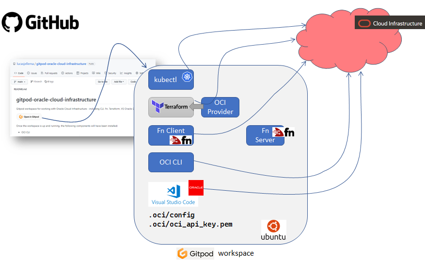

# gitpod-oracle-cloud-infrastructure
Gitpod workspace for working with Oracle Cloud Infrastructure - including CLI, Fn, Terraform, VS Oracle DevTools

[](https://gitpod.io/#https://github.com/lucasjellema/gitpod-oracle-cloud-infrastructure)

Once the workspace is up and running, the following components will have been installed:

* OCI CLI 
* Terraform with the OCI Provider for Terraform
* Fn Client and Fn Server (for serverless functions - locally and on OCI)
* Kubectl - not yet configured for any specific Kubernetes cluster
* VS Code extension Oracle DevTools
* OCI Desiger Tookit (OKIT) - a set of tools for enabling design, deploy and visualise OCI environments through a graphical web based interface (visualize an existing environment, create/draw a new or updated environment, generate Terraform definitions to provision designed resources, inspect BOM and cost estimates)

  

Before you can actually start working with Oracle Cloud Infrastructure, a little configuration is required.

The files *config* and *oci_api_key.pem* in directory *.oci* need to contain proper connection details for your OCI account. Please edit both files, provide the correct information. Then these two files config and oci_api_key.pem need to be copied to directory *~/.oci*. Please execute these commands in the terminal to perform that copy action:

```
mkdir ~/.oci
cp .oci/config  ~/.oci
cp .oci/oci_api_key.pem  ~/.oci
# check both files are located where they should be
ls -l  ~/.oci
# fix (warning about) too broad file permissions
oci setup repair-file-permissions --file /home/gitpod/.oci/config
oci setup repair-file-permissions --file /home/gitpod/.oci/oci_api_key.pem
```

Time for a first OCI CLI command: 

```
oci os ns get 
```

Hardly inspiring  but a good check to verify the connection details. Another one:

```
oci iam compartment list
```

## Run Okit - tools for enabling design, deploy and visualise OCI environments through a graphical web based interface

OKIT is started up with the Workspace, before the OCI config file and private key have been put in place. At this point, new OCI designs can be created but existing OCI resources cannot be inspected. Once you have configured the OCI config file and the private key file, you can restart OKIT using these next two commands. One OKIT has restarted, it can connect to your OCI Tenancy and visualize the resources. 

```
docker stop okit
docker run -d --rm -p 80:80 --volume /workspace/gitpod-oracle-cloud-infrastructure/okit/user/templates:/okit/templates --volume /workspace/gitpod-oracle-cloud-infrastructure/.oci:/root/.oci --volume /workspace/gitpod-oracle-cloud-infrastructure/.ssh:/root/.ssh --name okit okit
```

Then open the OKIT GUI at port 80.

See user guide for OKIT at [OKIT User Guide](https://github.com/oracle/oci-designer-toolkit/blob/master/documentation/Usage.md) 