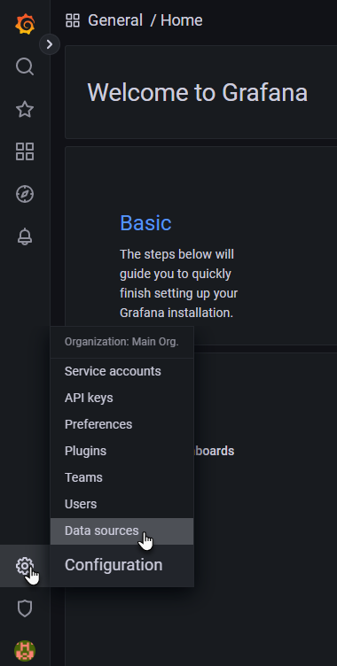
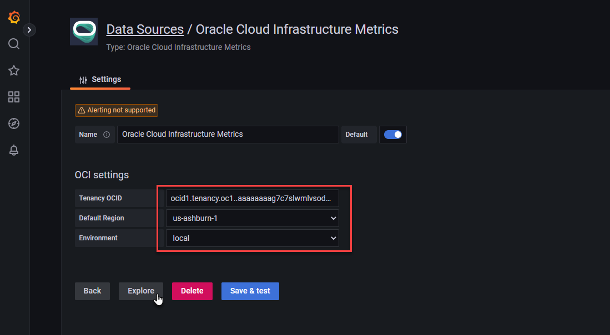
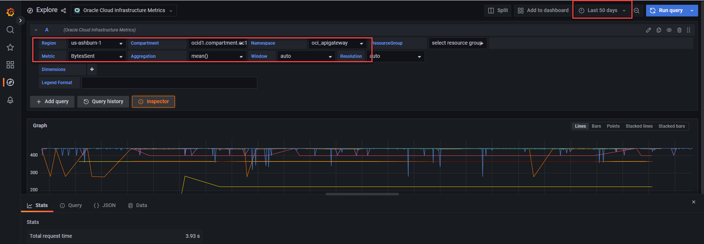

# gitpod-oracle-cloud-infrastructure
Gitpod workspace for working with Oracle Cloud Infrastructure - including CLI, Fn, Terraform, VS Oracle DevTools, OKIT, Grafana & OCI Plugin.

[](https://gitpod.io/#https://github.com/lucasjellema/gitpod-oracle-cloud-infrastructure)

Once the workspace is up and running, the following components will have been installed:

* OCI CLI 
* Terraform with the OCI Provider for Terraform
* Fn Client and Fn Server (for serverless functions - locally and on OCI)
* Kubectl - not yet configured for any specific Kubernetes cluster
* VS Code extension Oracle DevTools
* OCI Desiger Tookit (OKIT) - a set of tools for enabling design, deploy and visualise OCI environments through a graphical web based interface (visualize an existing environment, create/draw a new or updated environment, generate Terraform definitions to provision designed resources, inspect BOM and cost estimates)
* Grafana & OCI plugin for Grafana
* (planned) Ansible Collections for OCI
* (planned) Steampipe with OCI Plugin

  

Before you can actually start working with Oracle Cloud Infrastructure, a little configuration is required.

The files *config* and *oci_api_key.pem* in directory *.oci* need to contain proper connection details for your OCI account. Please edit both files, provide the correct information. Then these two files config and oci_api_key.pem need to be copied to directory *~/.oci*. Please execute these commands in the terminal to perform that copy action:

```
mkdir ~/.oci
cp .oci/config  ~/.oci
cp .oci/oci_api_key.pem  ~/.oci
# check both files are located where they should be
ls -l  ~/.oci
# fix (warning about) too broad file permissions
oci setup repair-file-permissions --file /home/gitpod/.oci/config
oci setup repair-file-permissions --file /home/gitpod/.oci/oci_api_key.pem
```

Time for a first OCI CLI command: 

```
oci os ns get 
```

Hardly inspiring  but a good check to verify the connection details. Another one:

```
oci iam compartment list
```

## Run Okit - tools for enabling design, deploy and visualise OCI environments through a graphical web based interface

OKIT is started up with the Workspace, before the OCI config file and private key have been put in place. At this point, new OCI designs can be created but existing OCI resources cannot be inspected. Once you have configured the OCI config file and the private key file, you can restart OKIT using these next two commands. One OKIT has restarted, it can connect to your OCI Tenancy and visualize the resources. 

```
docker stop okit
docker run -d --rm -p 80:80 --volume /workspace/gitpod-oracle-cloud-infrastructure/okit/user/templates:/okit/templates --volume /workspace/gitpod-oracle-cloud-infrastructure/.oci:/home/gitpod/.oci --volume /workspace/gitpod-oracle-cloud-infrastructure/.ssh:/root/.ssh --name okit okit
```

Then open the OKIT GUI at port 80.

See user guide for OKIT at [OKIT User Guide](https://github.com/oracle/oci-designer-toolkit/blob/master/documentation/Usage.md) 

## Run OCI Plugin for Grafana

Grafana is an open-source visualization and alerting tool that you can use for analytics and monitoring of time-series data (metrics). While metrics from Oracle Cloud Infrastructure Monitoring are visible in metrics charts through the OCI Console, you can use Oracle Cloud Infrastructure Data Source for Grafana ("the Grafana Plug-in") to view metrics from resources across providers on a single Grafana dashboard.

Docmentation on this plugin can be found here [OCI Grafana Plugin](https://docs.oracle.com/en-us/iaas/Content/API/SDKDocs/grafana.htm) and in the [plugin's GitHub repository](https://github.com/oracle/oci-grafana-metrics) 

The steps to install the plugin (automatically executed when the workspace was created) are described below. After this series of automated steps, you need to also perform a manual action - after you have configured the .oci/config file:

```
sudo cp -r /workspace/gitpod-oracle-cloud-infrastructure/.oci /usr/share/grafana
sudo chmod g+r /home/gitpod/.oci/oci_api_key.pem 
```
to copy the OCI Configuration file to the grafana user directory structure and make the private key file accessible to user *grafana*.

Note: this second statement will cause OCI CLI to write warnings about "too broad file permissions" on a sensitive file. To suppress these warnings, you can execute `export OCI_CLI_NO_WARN=true` in the terminal window or - to apply this setting across all terminal sessions - add this line to your shell configuration file (e.g., ~/.bashrc or ~/.zshrc). 

### These actions are performed automatically on Workspace startup

```
sudo apt-get install -y apt-transport-https
sudo apt-get install -y software-properties-common wget
wget -q -O - https://packages.grafana.com/gpg.key | sudo apt-key add -

echo "deb https://packages.grafana.com/oss/deb stable main" | sudo tee -a /etc/apt/sources.list.d/grafana.list

sudo apt-get update
sudo apt-get install grafana

sudo grafana-cli plugins install oci-metrics-datasource

sudo service grafana-server start
sudo service grafana-server status
```


### Start using the OCI Grafana Plugin

Now you can start using the OCI Data Source in Grafana (provided the OCI Configuration and Private Key file have been configured correctly). Open the Grafana Web Application at port 3000. On the login page, enter *admin* for username and password.

Click Log in. If login is successful, then you will see a prompt to change the password. 
Click OK on the prompt, then change your password.

To add a new Data Source of type OCI Metrics: in Grafana, on the Home Dashboard, click the gear icon on the left.
Click Add data source.
  
In the Filter text box, type: oracle-oci-datasource
In the filtered list, select oracle-oci-datasource.
In the Settings page, fill in your Tenancy OCID, Default Region, and Environment. For Environment choose local.
  

Click on Explore and compose query to evaluate metrics from OCI. For example this query that looks at data transfer through API Gateways over the last 50 days:
  

To troubleshoot you can inspect the Grafana server log:

```
sudo cat /var/log/grafana/grafana.log
```

### Resources


https://docs.oracle.com/en-us/iaas/Content/API/SDKDocs/grafana.htm
https://github.com/oracle/oci-grafana-metrics
https://grafana.com/grafana/plugins/oci-metrics-datasource

https://grafana.com/docs/grafana/v8.4/installation/debian/
